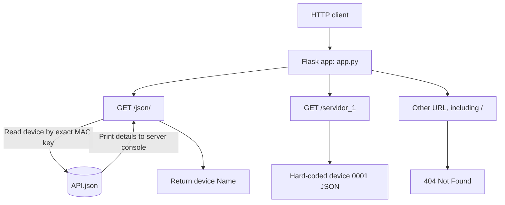

# FLASK Network API

A small Flask application that exposes sample network-device data. The active web application is defined in `app.py`; the other Python files are standalone exercises and are not imported or registered as web routes by the Flask app.

## Run the application

The project targets Python and Flask (Flask 3.1.3 is listed in `req.txt`). From the project directory, install Flask and start the development server:

```powershell
python -m pip install Flask==3.1.3
python app.py
```

The development server runs with debug mode enabled at `http://127.0.0.1:5000`. `app.py` opens `API.json` using a path relative to the current working directory, so start the command from the project directory.

## Routes

Both routes accept `GET` requests. There is no route for `/`, so the root URL returns Flask's not-found response.

| URL | Behavior | Successful response |
| --- | --- | --- |
| `/json/<mac>` | Looks up `<mac>` as a key in `API.json`, prints the device's `Name`, `Protocolos`, `VLANs`, and `status` to the server console, then returns only its `Name` as the response body. | `200 OK`, text response; for example `/json/3D:RF:09:7F::` returns `R1`. |
| `/servidor_1` | Returns the hard-coded sample record from the view function using Flask `jsonify`. | `200 OK`, JSON object containing device `0001`. |

`/json/<mac>` requires an exact key from `API.json`. An unknown key currently raises `KeyError` and produces a server error; the route does not define a custom not-found response. The `/servidor_1` payload is fixed in `app.py` and does not read from `API.json`.

### Route map



## Project files

| File | Purpose |
| --- | --- |
| `app.py` | Flask app and the two HTTP routes documented above. |
| `API.json` | Device records used by `/json/<mac>`. |
| `req.txt` | Python package list. |
| `c1.py`–`c6.py`, `c1E.py`, `ex.py`, `exr.py` | Standalone practice/exploration scripts; they do not add Flask routes. |

## Git branches

At the time this file was written, the checked-out local branch was `feture/flaskv01`. The requested remote repository is `https://github.com/20243rd057-droid/FLASKN.git`; its advertised branches were `main`, `feature`, `hotfix`, `patch`, `release`, `release2`, and `release3`. Those remote refs all pointed to the same commit when checked. No branch naming or merge policy is configured in the local project; these names are a snapshot, not an asserted workflow. The initial local commit and push should be made from the checked-out branch unless a different target is chosen.