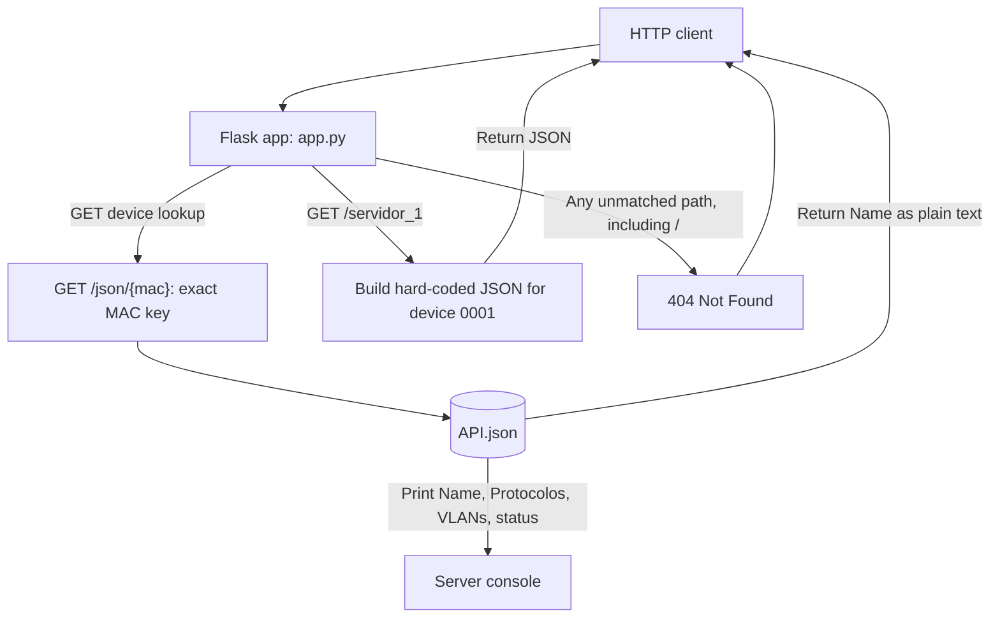

# FLASK Network API

A small Flask application that exposes sample network-device data. The active web application is defined in `app.py`; the other Python files are standalone exercises and are not registered as Flask routes.

## Run the application

Install the dependencies and start the development server from the project directory:

```powershell
python -m pip install -r req.txt
python app.py
```

The app runs in debug mode at `http://127.0.0.1:5000`. `app.py` opens `API.json` relative to the current working directory, so start it from the project directory.

## Routes

Both routes accept `GET` requests.

| URL | Behavior | Successful response |
| --- | --- | --- |
| `/json/&lt;mac&gt;` | Uses `&lt;mac&gt;` as an exact key in `API.json`. Prints the device's `Name`, `Protocolos`, `VLANs`, and `status` to the server console, then returns only `Name` in the HTTP response body. | `200 OK`, plain text; for example, `/json/3D:RF:09:7F::` returns `R1`. |
| `/servidor_1` | Returns the hard-coded sample record in the view function. It does not read from `API.json`. | `200 OK`, JSON object containing device `0001`. |

`/json/&lt;mac&gt;` requires an exact key present in `API.json`. An unknown key currently raises `KeyError` and results in a server error; the route does not define a custom not-found response. There is no route for `/`, so the root URL returns Flask's `404 Not Found` response.

### Route map



## Project files

| File | Purpose |
| --- | --- |
| `app.py` | Flask application and its two HTTP routes. |
| `API.json` | Device records used by `/json/<mac>`. |
| `req.txt` | Python package requirements. |
| `c1.py`-`c6.py`, `c1E.py`, `ex.py`, `exr.py` | Standalone exercise scripts; they do not register Flask routes. |

## Branches

The checked-out local branch is `feture/flaskv01` (spelled `feture`, not `feature`) and tracks `origin/feture/flaskv01`. This is the branch containing the current app work. The configured remote is `https://github.com/20243rd057-droid/FLASKN.git`.

The following other branch names were visible on the remote during the repository scan. Their purposes are not documented in the repository; the descriptions below are conventional interpretations of their names, not verified workflow rules.

| Branch | Likely conventional purpose |
| --- | --- |
| `main` | Stable or default branch. |
| `feature` | Feature development or integration. |
| `hotfix` | Urgent production fixes. |
| `patch` | Small corrective changes. |
| `release`, `release2`, `release3` | Release preparation or release snapshots; the numbered branches' distinctions are unknown. |

Remote branch names and tracking relationships can change. Check `git branch -avv` and `git ls-remote --heads origin` for the current state before choosing a push target.